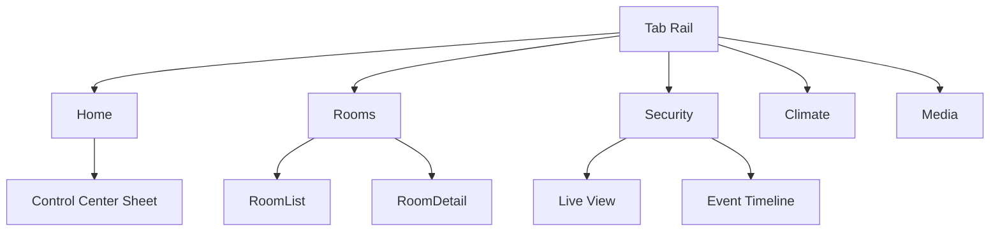

# Tab5 Home Controller — Low-Fi Wireframes (AI Source of Truth)

Target device: **M5Stack Tab5** (landscape 1280×720).  
UI framework: **LVGL**.  
Primary integration: **Home Assistant (MQTT + Assist)**, **Frigate**.

## Design Tokens (names AI should reuse)
- Spacing: `space-4=4px`, `space-8=8px`, `space-16=16px`, `space-24=24px`, `space-32=32px`
- Radii: `radius-20=20px` (cards), `radius-12=12px` (chips)
- Elevation: `elev-1` (small), `elev-2` (medium)
- Colors: `surface-1=#0E1216`, `surface-2=#151B22`, `text=#E6EDF3`, `muted=#9AA6B2`, `accent=#22C55E`, `warn=#F59E0B`, `alert=#EF4444`
- Typography: `title-lg`, `title-md`, `body`, `caption`
- Motion: `dur-fast=90ms`, `dur-med=200ms`, `dur-slow=300ms`, `ease-out`
- Touch targets: **min 56×56 px**

> **Rule:** Prefer **RGB565** assets sized for on-screen use; avoid per-frame allocations; cap ambient animations to 30 FPS; interaction animations target 60 FPS.

---

## Global Structure (Navigation)
- Tabs: **Home**, **Rooms**, **Security**, **Climate** (optional **Media**)
- Left-side **nav rail** (implemented) with icon+label buttons for ESP32P4 demo, Rooms, Frigate Security, Local Climate Station, and TV Controls
- Full-bleed wallpaper rotates between `custom/assets/bg/1.png` and `custom/assets/bg/2.png` every 30 seconds on custom pages
- **Control Center** opens as modal sheet (swipe down from header or tap status icons)



## Screen 1 — Home

### Layout

```
Screen 1 — Home
--------------------------------------------------------  y=0
| Time 10:24  | Weather 26°C | Battery 78% | Wi-Fi -53dB |  Header (56px)
--------------------------------------------------------  y=56
| [Alarm: Armed] [Doors: 1 Open] [Cams: OK] [Presence: 2]|  Status Chips row (56px)
--------------------------------------------------------  y=112
|   [ Lights ]     [ Climate ]     [ Security Snapshot ] |  3 Cards @ equal width
|   - toggle       - setpoint      - last event thumb    |
|   - dimmer       - humidity      - Live button         |
--------------------------------------------------------  y=424
| Quick Actions: [Goodnight] [I'm Home] [Away Mode]      |  QA row (72px)
--------------------------------------------------------  y=496
|                ( content spacer )                      |
--------------------------------------------------------  y=664
|    Home | Rooms | Security | Climate | Media           |  Right-edge tab rail in code; shown here as bottom bar
--------------------------------------------------------  y=720
```

### Interactions

- Tap card → expand to detail; animate scale 0.98 then expand (`dur-med`).
- Long-press Quick Action → confirm sheet (show list of changes).
- Status chip with anomaly uses `accent`/`warn`/`alert` tokens and navigates to source screen.

### Acceptance

- From idle, key info readable in under 2 seconds.
- All primary controls reachable with no more than two taps.

## Screen 2 — Rooms

### Layout

```
Screen 2 — Rooms
+------------------+------------------------------------+
| Rooms            | Living Room                        |
| [Living Room] ●  | [Group Lights Dimmer 0—100%]       |
| [Bedroom]        | [Light 1][Light 2][Lamp][Strip]    |
| [Kitchen]        | [Fan: 0 1 2 3] [Osc ⟳]             |
| [Office]         | Sensors: T 24.1°  H 48%  Lux 120   |
| [Patio]          | Scenes: [Movie][Bright][Night]     |
+------------------+------------------------------------+
```

### Interactions

- Tap room → updates detail pane.
- Two-finger swipe left/right → next/previous room.
- Long-press a light → opens per-entity details.

### Acceptance

- Room switch provides visible response within 150 ms.
- All per-room entities visible without scrolling for up to 8 devices; overflow uses wrap chips.

## Screen 3 — Security (Frigate)

### Layout

```
Screen 3 — Security (Frigate)
Top Bar: [◀]  Camera 2/4  [▶]      [Quality: Auto] [Mute]

+----------------------------------------------+
|                 Live Video                   |  (auto preview; tap to go live)
|         (PIP shows if navigating away)       |
+----------------------------------------------+

Recent Events (horizontal scroll):
[Person@Door 2m] [Vehicle@Drive 8m] [Motion Back 12m] [...]

Action row:
[Open Gate] [Talk] [Snapshot] [Timeline ▾]
```

### Interactions

- Event chip → opens clip viewer (PiP if live running).
- Alert mode (priority Home Assistant event): whole screen frames in `warn`/`alert`, auto focus, haptic tick (audible click).

### Acceptance

- Live start under 1.5 seconds on local network (fallback from HLS → MJPEG → snapshot).
- Loss of stream shows “Low bandwidth” badge and retry call-to-action.

## Screen 4 — Control Center (Modal Sheet)

### Layout

```
Screen 4 — Control Center (Modal Sheet)
-------------------------------------------
|  Control Center                         |
|  Brightness [====------]  60%           |
|  Volume     [===-------]  30%  [Mute]   |
|  Toggles: [Do Not Disturb] [Auto Bright]|
|  Network: MyWiFi_5G  RSSI -53 dB        |
|  Power:   [Sleep Now] [Restart UI]      |
-------------------------------------------
```

### Interactions

- Sheet appears via swipe-down from header or status tap; dismiss via swipe-down or background tap.
- Brightness and volume sliders use `dur-fast` easing for thumb feedback; Mute toggles instantly.

### Acceptance

- Controls remain operable without leaving current tab context.
- Critical toggles accessible within one gesture from any screen.
