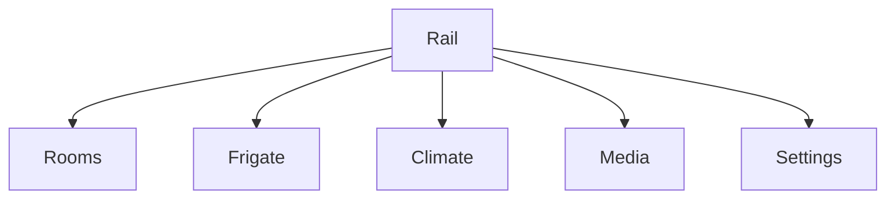

# Tab5 Home Controller — Low-Fi Wireframes (AI Source of Truth)

Target device: **M5Stack Tab5** (landscape 1280×720).
UI framework: **LVGL**.
Primary integration: **Home Assistant (MQTT + Assist)**, **Frigate**.

## Design tokens (names AI should reuse)

- Spacing: `space-4=4px`, `space-8=8px`, `space-16=16px`, `space-24=24px`, `space-32=32px`
- Radii: `radius-20=20px` (cards), `radius-12=12px` (chips)
- Elevation: `elev-1` (small), `elev-2` (medium)
- Colors: `surface-1=#0E1216`, `surface-2=#151B22`, `text=#E6EDF3`, `muted=#9AA6B2`, `accent=#22C55E`,
  `warn=#F59E0B`, `alert=#EF4444`
- Typography: `title-lg`, `title-md`, `body`, `caption`
- Motion: `dur-fast=90ms`, `dur-med=200ms`, `dur-slow=300ms`, `ease-out`
- Touch targets: **min 56×56 px**

> **Rule:** Prefer **RGB565** assets sized for on-screen use; avoid per-frame allocations; cap ambient
> animations to 30 FPS; interaction animations target 60 FPS.

---

## Global structure (navigation)

- Left-side **nav rail** holds icon+label buttons for **Rooms**, **Frigate Security**,
  **Local Climate**, **Media**, and **Settings**.
- Rooms opens by default on boot so the dashboard is immediately actionable.
- Rail is hidden by default; a left-edge drag reveals it, and releasing past one-third of the travel
  keeps it open. Nav buttons close the rail after changing screens.
- A translucent scrim covers content while the rail is open; tapping the scrim or swiping the rail
  left hides navigation and restores touch to the page.
- Wallpapered backgrounds remain visible beneath the scrim so the reveal feels attached to the
  surface layer.



## Screen 1 — Rooms

### Layout — Rooms

```text
Screen 1 — Rooms
+------------------------------------------------------+
| Rooms                                                |
+------------------------------------------------------+
| [Bakery]    [Bedroom]    [Living Room]               |
|  toggle      toggle        toggle                    |
|  temp/humidity badges update per room                |
+------------------------------------------------------+
```

### Interactions — Rooms

- Tap the toggle on any card to fire the room power signal with haptic-style feedback.
- Long-press anywhere on a card to request the detailed sheet for that room/entity pair.
- On first entry, toolbar and cards animate into place (slide/fade, 40 ms stagger).

### Acceptance — Rooms

- Three featured rooms remain above the fold with no scrolling.
- Climate badges stay legible even when MQTT updates arrive every second.

## Screen 2 — Frigate Security

### Layout — Frigate Security

```text
Screen 2 — Frigate Security
+------------------------------------------------------+
| Frigate Security                                    |
| [◀ Prev]  Camera 2 of 6  [Next ▶]  [Quality ▾] [🔈 Mute]
+------------------------------------------------------+
| Card: Backyard Camera                               |
|  • Live feed placeholder fills card body            |
|  • Status line: "Streaming · 1080p60"               |
+------------------------------------------------------+
| Event cards row (wraps):                            |
|  [Front Door · Person]  [Garage · Motion] ...       |
+------------------------------------------------------+
| Actions row: [Open Gate] [Talk] [Snapshot] [Timeline]
+------------------------------------------------------+
```

### Interactions — Frigate Security

- Prev/Next camera buttons are styled primary controls, ready to bind camera cycling.
- Event cards hide toggles and reserve space for timestamps; tapping can route to clip playback.
- Action buttons ship as large pills so gloves can trigger automations.

### Acceptance — Frigate Security

- Live feed container supports 280 px tall video without layout shifts.
- Four quick actions stay visible at 48 px minimum tap targets.

## Screen 3 — Local Climate

### Layout — Local Climate

```text
Screen 3 — Local Climate
+------------------------------------------------------+
| Local Climate Station                                |
+------------------------------------------------------+
| Card: Living Room Climate                            |
|  Indoor temperature / humidity / HVAC mode stack     |
+------------------------------------------------------+
| Card: Outdoor Sensors                                |
|  sensor.tab5_temperature / sensor.tab5_humidity      |
+------------------------------------------------------+
| Forecast label + three-day chip row                  |
+------------------------------------------------------+
```

### Interactions — Local Climate

- Cards are informational; toggles and spec rows are hidden to keep data dense.
- Forecast chips flex to fill the row and respond to theme color shifts.

### Acceptance — Local Climate

- Both indoor and outdoor cards stay readable without scrolling.
- Forecast row maintains equal spacing on 1280 px landscape.

## Screen 4 — Media

### Layout — Media

```text
Screen 4 — Media
+------------------------------------------------------+
| Card: Now Playing                                    |
|  [240×240 album art]  Track title / artist / source  |
|  Transport row: [Prev][Play/Pause][Next] [Volume ▬▬] |
+------------------------------------------------------+
| Card: Quick Scenes                                   |
|  [Morning] [Movie] [Night] [Party]                   |
+------------------------------------------------------+
```

### Interactions — Media

- Transport buttons use accent styling and stretch to equal widths for reliable taps.
- Volume slider tracks 0–100 with immediate value updates.
- Scene chips are pill buttons sized for one-thumb access.

### Acceptance — Media

- Album art and metadata remain side-by-side without overlap at 48 px padding.
- All transport controls sit within a single row to avoid reach shifts.

## Screen 5 — Settings

### Layout — Settings

```text
Screen 5 — Settings
+------------------------------------------------------+
| Connectivity card: Wi-Fi / Home Assistant / Cloud    |
|  • Each tester button with status pill               |
+------------------------------------------------------+
| Theme & Display card: dark mode switch, palette      |
|  dropdown, brightness slider with value label        |
+------------------------------------------------------+
| Network & Time card: Wi-Fi settings / Sync clock /   |
|  Display tools buttons (two-column layout)           |
+------------------------------------------------------+
| Updates card: status label + (Check updates / Start  |
|  OTA) buttons                                        |
+------------------------------------------------------+
| Diagnostics card: Run diagnostics / Export logs      |
+------------------------------------------------------+
| Backup & Restore card: Backup now / Restore backup   |
+------------------------------------------------------+
```

### Interactions — Settings

- Connection tester buttons fire async callbacks and surface status through colored pills.
- Dark mode switch, palette dropdown, and brightness slider emit events only when users interact
  (not during state sync).
- Action buttons are grouped per card and reuse the same callback dispatcher for analytics.

### Acceptance — Settings

- Every control maintains ≥45 px touch height despite dense cards.
- Status labels update asynchronously without tearing hidden cards into view.
